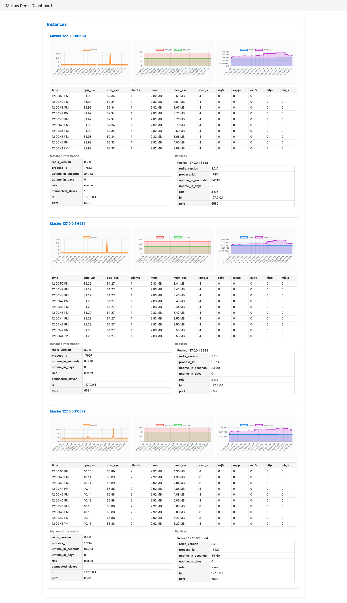

# Stormy

Stormy is a real-time dashboard for visualizing Redis metrics, which is inspired by [junegunn/redis-stat](https://github.com/junegunn/redis-stat).

You can monitor command throughput, CPU, memory usage, and instance information with charts and tables.

## Screenshot

The following is generated for each master node and its associated replica nodes.

- Top: charts for cmd/s, CPU, and memory metrics
- Middle: recent metrics history table
- Bottom: Redis instance information

## Usage

1. Create a config json. ref. `stormy-config.json`
   1. `"name": <your standalone/sentinel/cluster name>`

      Accepts an arbitrary value.
   2. `"instances": <instances in the named Redis>`

      Basically, specifying a `redis-server` node is sufficient to discover all nodes, but for redundancy it is recommended to specify multiple or all nodes.
   3. `"password": <the password you set with AUTH>`

      Not set, then please leave it empty.
2. `stormy <config.json>` will start the server.
3. Open your browser and access `http://127.0.0.1:8080/`.
4. The dashboard will be displayed.

## Features

- Real-time Redis metrics visualization (every seconds)
- Charts for command throughput, CPU, and memory usage (up to 1 hour of data)
- Recent metrics history table (up to 10 seconds of data)
- Instance information table

## License

MIT
